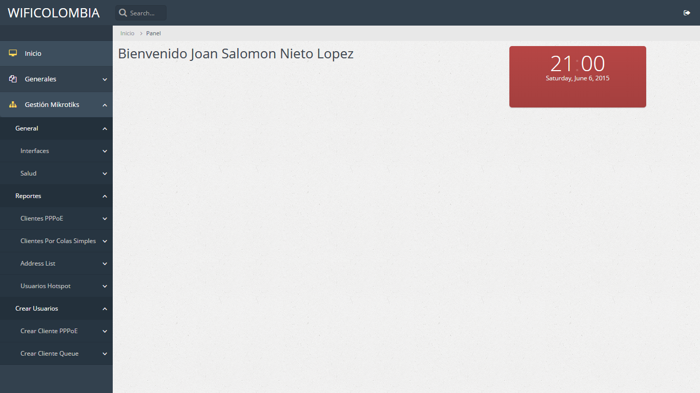
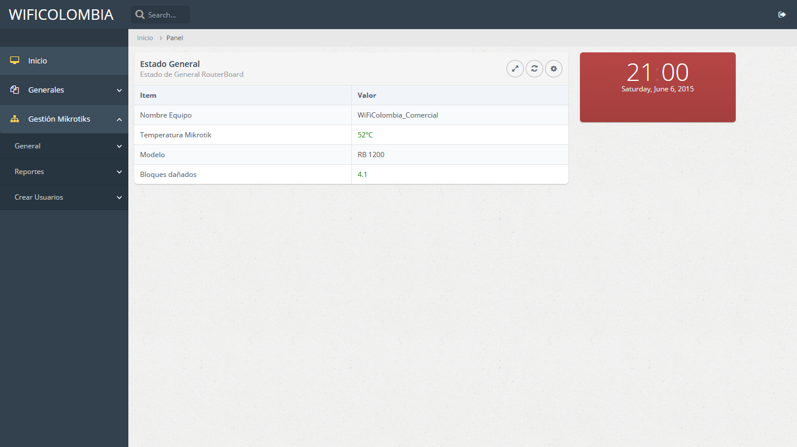

# Sistema de gestión Mikrotik PHP

Esta un poco modificada a la version original, el cambio mas importante es que puede ser usado a partir de la version 6.43, sin embargo, si tiene una version anterior, modifique el archivo apimikrotik.php, comentando la linea 106 y descomente la linea 108.

Está hecho principalmente para configuraciones ppp, otras opciones aun en desarrollo.

# Base de Datos

En la carpeta 'includes' se encuentra el archivo mikrotiks.sql al final está la linea de insert, sustituya el nombre de usuario y la clave (en sha1) para loguearse.

Tambien realice un insert en la tabla mikrotiks colocando la ip del mikrotik, el nombre que desee colocar a ese mikrotik (esto es para identificar si tiene varios mikrotiks) el usuario y la clave con que se loguea en mikrotik (esto son los usuarios que usa para loguearse por winbox).

# Algunas Modificaciones

En menu.php coloque la direccion donde se encuentra este administrativo, por ejemplo: localhost/
En variables.php coloque la informacion de su base de datos (address, user, password, databse).

---------------------------------------------------------------------------------------------------------------------------------

Esta es la versión inicial del sistema de control de Mikrotik RouterBoard desde PHP.

El directorio includes debe colocarse en la raiz (C:\WAMP  en Windows con WAMP Server o /var/ en linux).

#Capturas de Pantalla

Login

Inicio

Estado Interfaces

Estado General

Listado Usuarios Usermanager

Creacion Usuario Usermanager para PPPoE o Hotspot

Creacion Usuario Queue con Validación de IP

